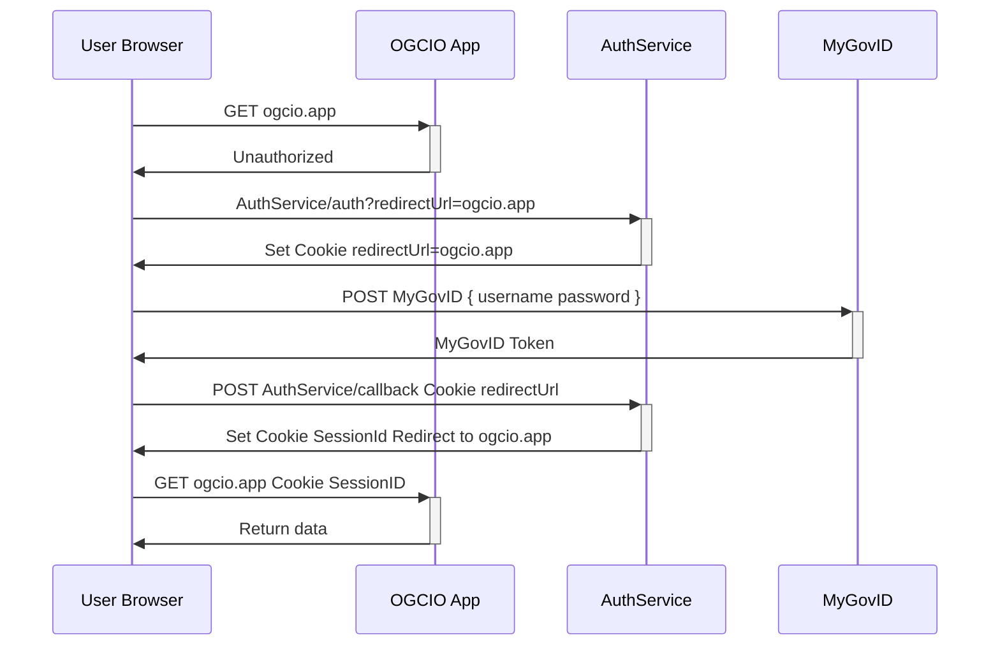
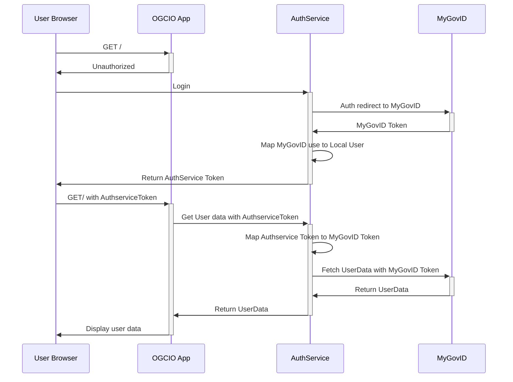

# Authentication

This part is still under costruction and changes are due when MyGovID integration will be complete.
Also Logto is going to expand/replace `AuthService` in the future.

The Authentication flow is outlined in the following sequence diagram.

The Authservice for now is responsbile to mock the MyGovID authentication flow, hence `AuthService` and `MyGovID`
are to be considered a single entity at the present time

To implement authentication in a NextJS app, you can use the `auth` package and call `PgSessions.get()`. This function will handle retrieving session data using the `sessionID` cookie or redirecting to the `AuthService` specified by the `AUTH_SERVICE_URL` environment variable.

To log out, simply make a GET request to `/auth/logout`. Make sure to include the `redirectUrl` query parameter to specify where users should be redirected after logging out and potentially logging back in.

## old flow

