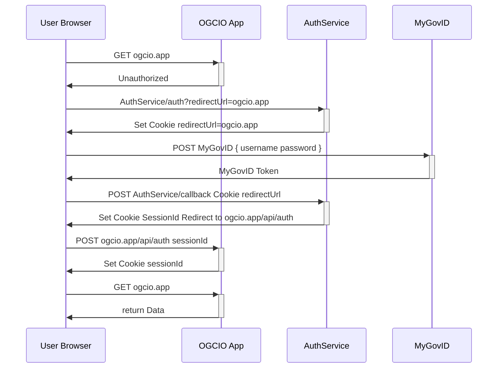
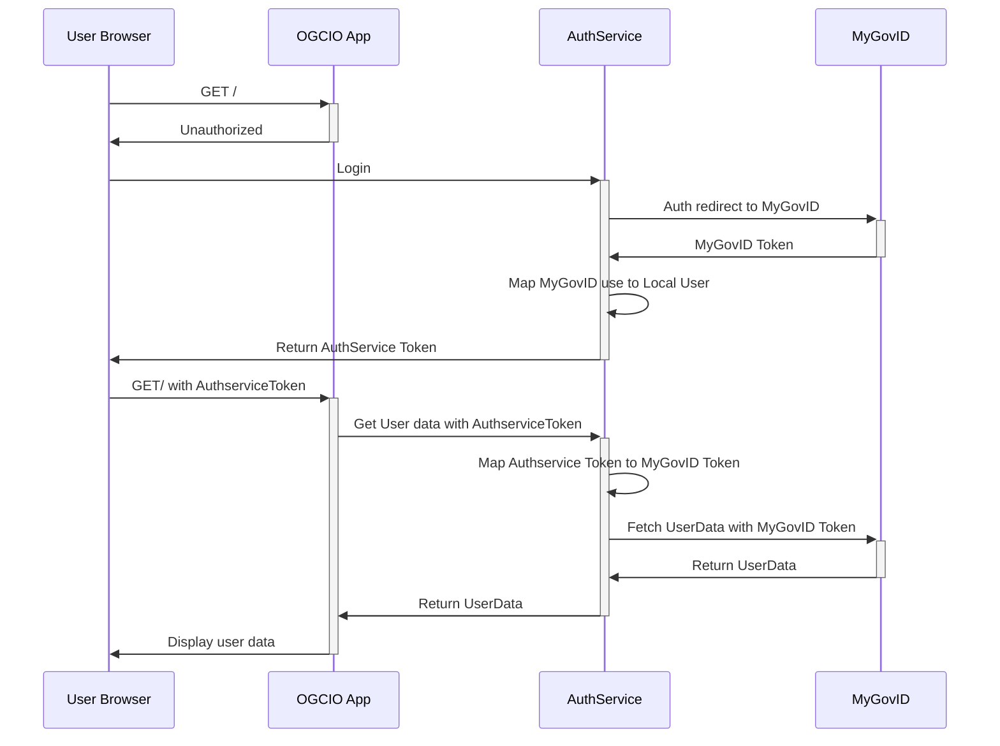

# Authentication

This part is still under costruction and changes are due when MyGovID integration will be complete.
Also Logto is going to expand/replace `AuthService` in the future.

The Authentication flow is outlined in the following sequence diagram.

The Authservice for now is responsbile to mock the MyGovID authentication flow, hence `AuthService` and `MyGovID`
are to be considered a single entity at the present time



## Integrating Auth service in your webapp

Auth service checklist integration:

- [ ] ENV VARS: HOST_URL set to the current application URL and AUTH_SERVICE_URL pointing to the auth service
- [ ] Expose an API route for logging in /app/api/auth/route.ts

Ideally this file should contain

```typescript
import route from "auth/route";
export const POST = route;
```

- [ ] Logout URL set to `AUTH_SERVICE_URL/auth/logout?redirectUrl=HOST_URL`
- [ ] Protect routes with `PgSessions.get()`, this API will return session data or redirect to Login

## old flow


