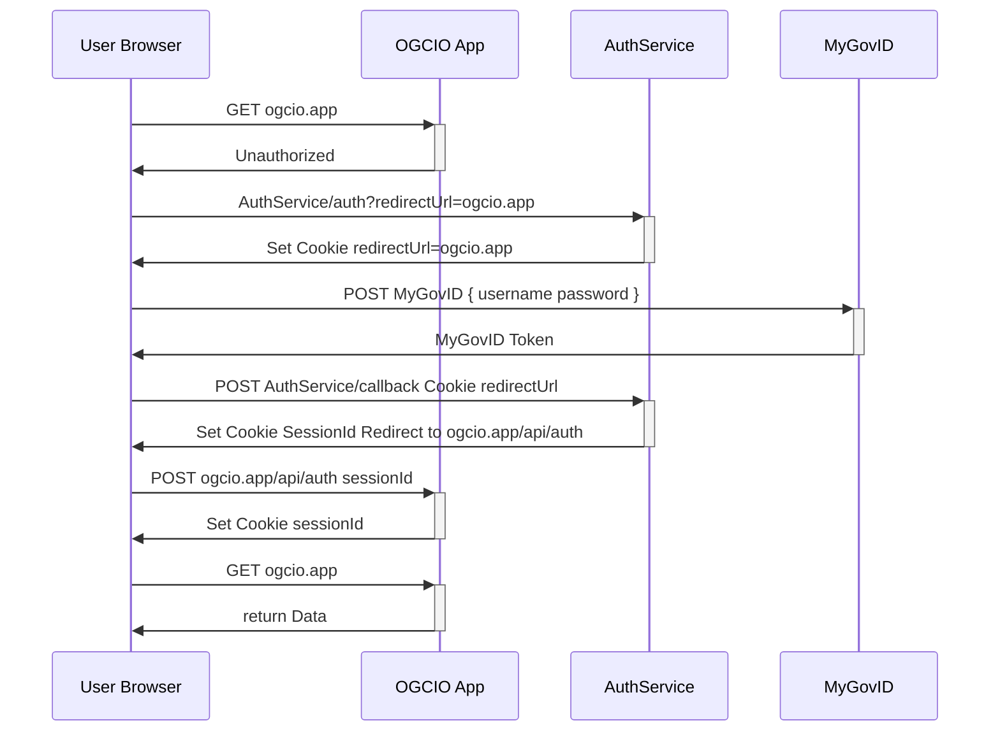
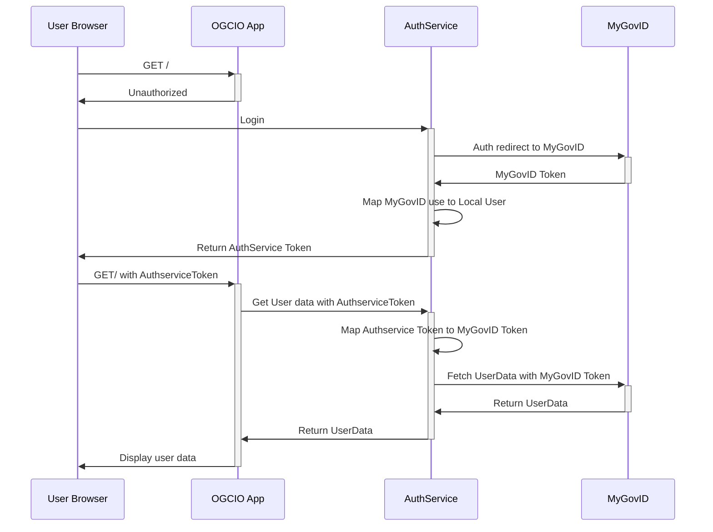
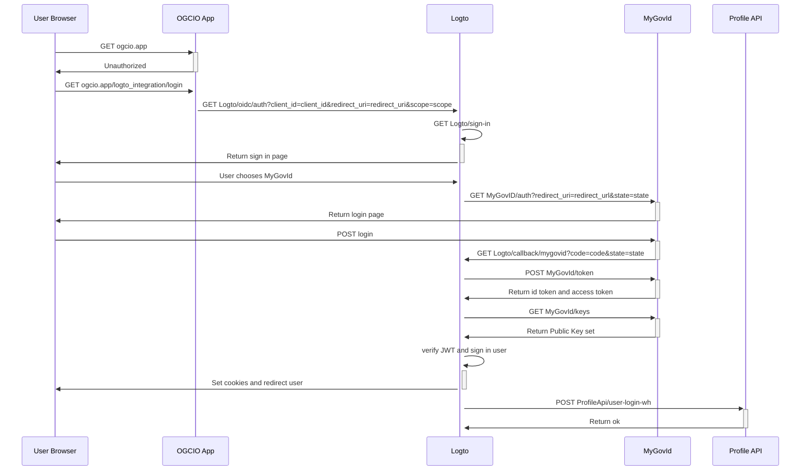

# Authentication

This part is still under costruction and changes are due when MyGovID integration will be complete.
Also Logto is going to expand/replace `AuthService` in the future. See dedicated section for Logto integration.

The Authentication flow is outlined in the following sequence diagram.

The Authservice for now is responsbile to mock the MyGovID authentication flow, hence `AuthService` and `MyGovID`
are to be considered a single entity at the present time



## Integrating Auth service in your webapp

Auth service checklist integration:

- [ ] ENV VARS: HOST_URL set to the current application URL and AUTH_SERVICE_URL pointing to the auth service
- [ ] Expose an API route for logging in /app/api/auth/route.ts

Ideally this file should contain

```typescript
import route from "auth/route";
export const POST = route;
```

- [ ] Logout URL set to `AUTH_SERVICE_URL/auth/logout?redirectUrl=HOST_URL`
- [ ] Protect routes with `PgSessions.get()`, this API will return session data or redirect to Login

## old flow




## MyGovId and Logto integration

### How it works
To enable users to register and log in using their MyGovId account, a custom social connector has been added in our Logto fork. This connector is then used as sign in method in the sign in experience that we've customized. This is currently the only sign in method enabled.
While the user experience is very simple - they just click on the `Login with MyGovId` button and then log in using their MyGovId credentials - the connector under the hood takes care of covering the whole authentication flow.

Roles and permissions are seeded in Logto database as part of the Logto deployment process. Roles are currently assigned to users by the connector, and permissions are coupled with roles as configured in the Logto seeder.



### How to integrate Logto in your app

A set of utilities to log in, log out and get the Logto context are available in the `auth` package, so to integrate with Logto you won't need to use the Logto SDK directly but make sure to add auth package to your dependencies.
If you call APIs using the SDK make sure the Bearer token is added to the request headers (example).
When logging in a user be mindful to request all the scopes that they might need during the session, since a new set of scopes can be requested only upon logging in again. Scopes are validated against role and permissions on Logto side, so you can request any.
To configure permission for your APIs you can leverage the `api-auth` package. Register the plugin:

```
import apiAuthPlugin from "api-auth";

app.register(apiAuthPlugin, {
    jwkEndpoint: process.env.LOGTO_JWK_ENDPOINT as string,
    oidcEndpoint: process.env.LOGTO_OIDC_ENDPOINT as string,
    currentApiResourceIndicator: process.env
        .LOGTO_API_RESOURCE_INDICATOR as string,
});
```

config values for local environment are:

```
LOGTO_JWK_ENDPOINT=http://localhost:3301/oidc/jwks
LOGTO_OIDC_ENDPOINT=http://localhost:3301/oidc
LOGTO_API_RESOURCE_INDICATOR=http://localhost:8001/
```

You can then call the `checkPermissions` method of the plugin in the `preValidation` hook (see example). The method supports by default AND matching logic, but


### How to test the integration locally

A mock of MyGovId is currently spun together with the Logto apps when running Logto locally.
It mocks the flow by exposing the auth, token and jwks endpoints that our custom MyGovId connector will call. A dedicated seeder file for Logto resources is execute as part of the process when running Logto locally - that configures the connector with the mocked endpoints.

The mocked flow is the following:

- login flow is initialised by Logto
- user logs in choosing MyGovId account
- user is redirected to http://localhost:4005/logto/mock/auth and presented with a mock login page
- when the login form is submitted http://localhost:4005/logto/mock/login is called. The api creates a mock, signed jwt and redirects the user to Logto callback, passing `state` and the id token as `code`
- Logto calls our mock token endpoint on http://mock-auth-service:4005/mock/token, that will return the user tokens and info.
- Logto calls our mock jwk set endpoint on http://mock-auth-service:4005/mock/keys to get the public key set and verify the signature of the token it just got from us
- Logto verifies the identity of the user and signs in the user. If the user is not registered yet they are signed up first.


There are a few issues that haven't been addressed yet:
- Redirection to the previous route is missing
- To allow registration of new users in Logto the jwt returns a random sub and a random mobile (used for user identification with id and phone number). Atm to log in with a user that is already created you need to link the account when prompted (Logto identity verification will find an account with same email, but different id and phone number)


roles and permissions - is this out of scope?

mermaid schema with various calls?
