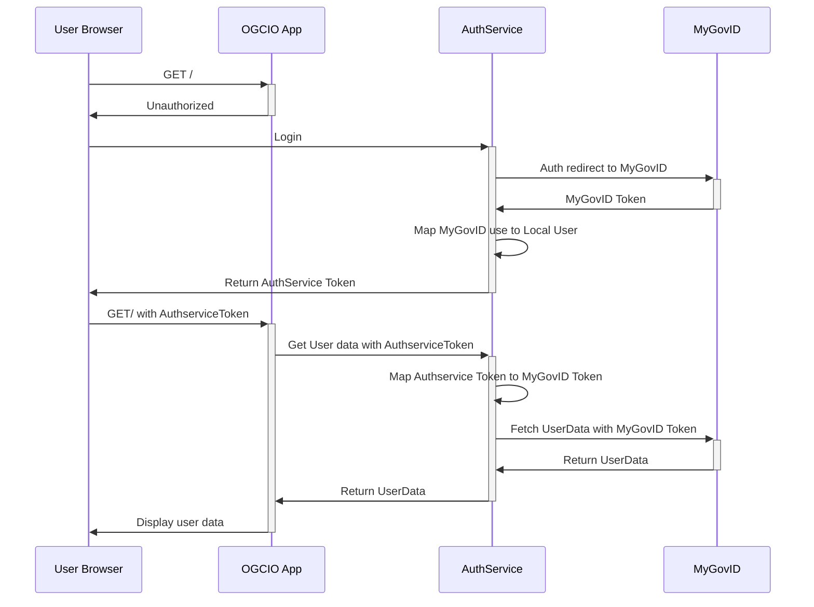

# Authentication

The Authentication flow is outlined in the following sequence diagram

```mermaid
sequenceDiagram
    User Browser->>+OGCIO App: GET /
    OGCIO App->>-User Browser: Unauthorized
    User Browser->>+AuthService: Login
    AuthService->>+MyGovID: Auth redirect to MyGovID
    MyGovID->>-AuthService: MyGovID Token
    AuthService->>AuthService: Map MyGovID use to Local User
    AuthService->>-User Browser: Return AuthService Token
    User Browser->>+OGCIO App: GET/ with AuthserviceToken
    OGCIO App->>+AuthService: Get User data with AuthserviceToken
    AuthService->>AuthService: Map Authservice Token to MyGovID Token
    AuthService->>+MyGovID: Fetch UserData with MyGovID Token
    MyGovID->>-AuthService: Return UserData
    AuthService->>-OGCIO App: Return UserData
    OGCIO App->>-User Browser: Display user data
```
